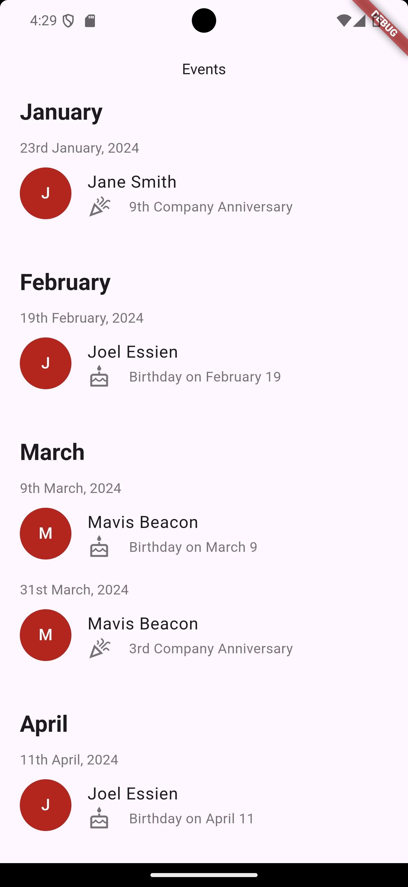
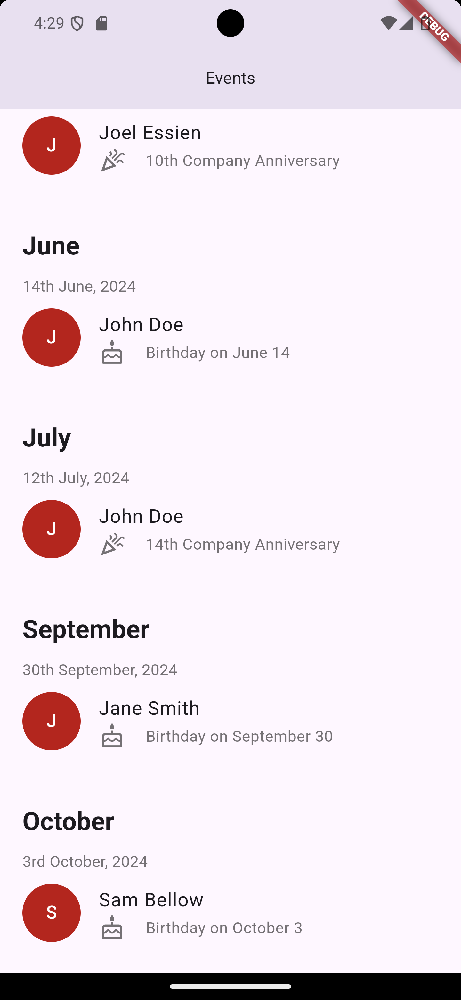

# Amalitech-Interview-Demo

The **Employee Celebration App** is a mobile application designed to celebrate employees on their **birthday** and **company anniversary**. It provides a user-friendly interface to remind and display celebratory messages or surprises for employees on these special occasions.

 

## Feature
- **Birthday Celebration**:Celebrate and displays an employee's birthday on a particular date within the month.
- **Anniversary Celebration**: celebrates an employee on their work anniversary with a custom message.

## Demo

## Installation

Follow the instructions below to set up the app in your development environment:

### Prerequisites

- [Flutter](https://flutter.dev/docs/get-started/install) installed
- IDE (e.g., VS Code, Android Studio)

### Steps

1. **Clone the repository**:
   git clone https://github.com/your-username/employee-celebration-app.git
